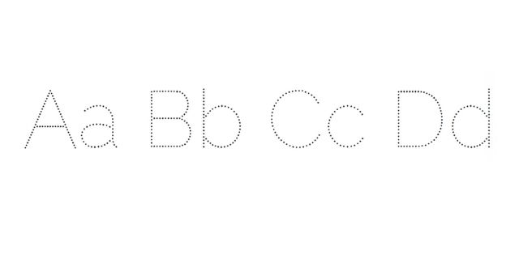

# kids-worksheet-generator
Generate handwriting practice worksheets for toddlers / kids aged 1-3

## Plan for this project
- A simple project to produce handwriting worksheets
- Fetch words and/or use a dictionary of short words (maximum four letters)
- Output a printable PDF document

"Necessity is the mother of invention"

##Prerequisites
- python > 3.10.x - Go to [link](https://www.python.org/downloads/) to download it
